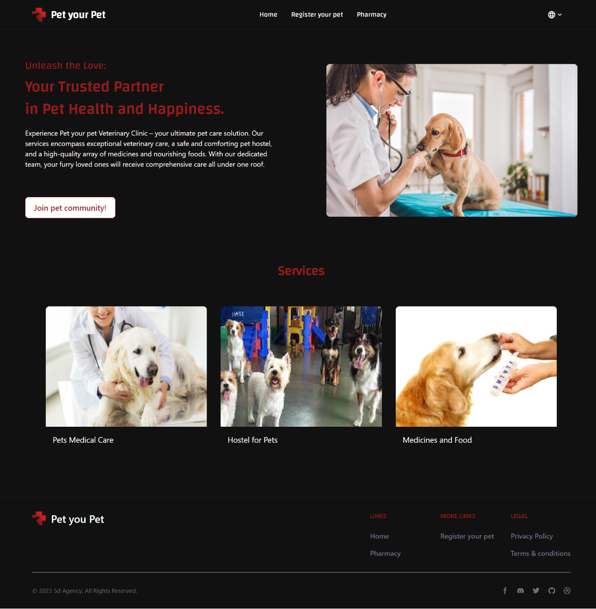
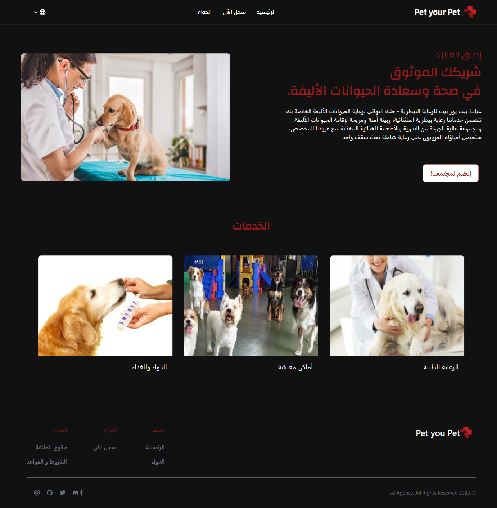
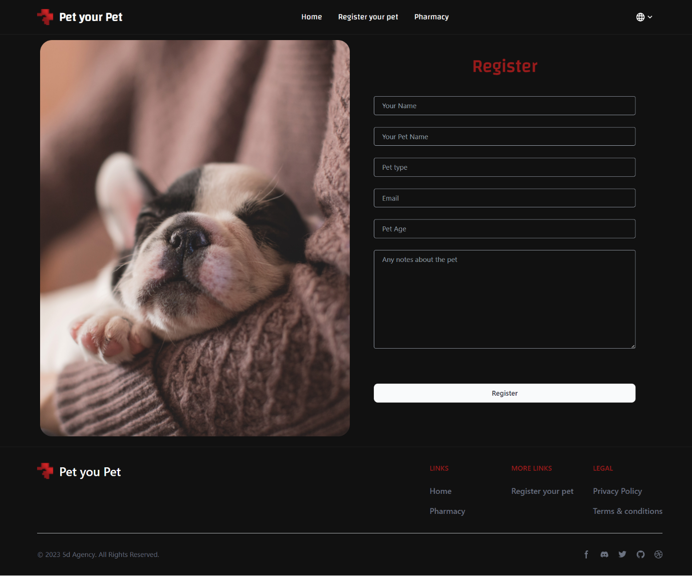
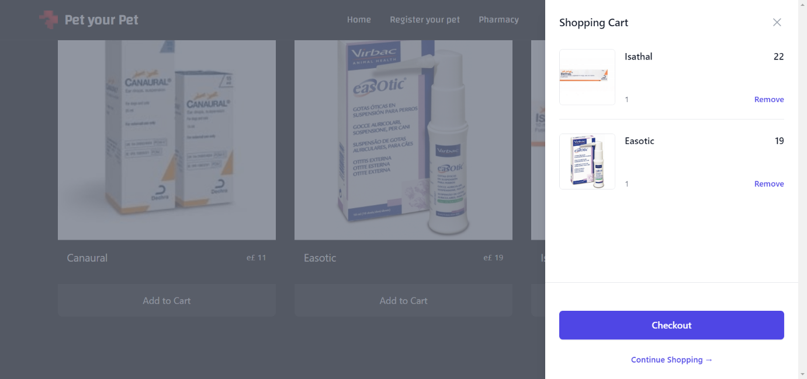

# Pet your Pet

This project is a task submitted to **5D agency** and developed by **Omar Reda**

# Install

1- You can run the project **locally** by run `npm i `

2- Then command `npm run dev`

or see **Demo**[ here](https://pet-your-pet.vercel.app)

## Feautres

1- **Two languages support** ( Arabic and English )  
User Can change the language from the dropdown menu in Navbar.  
2- **Pet Register** and confirming the register with **email sending**  
3- **Shopping** ( Food and Medicine)  
4- **Shopping Cart** functionality  
5- **Responsive Design**  
Others ..

## See some project views

| |  
|
|
|

## Main Technologies

React.js - tailwind - React-rourer-dom

## Copyrights

&copy; Copy rights reserved Omar Reda 2023
